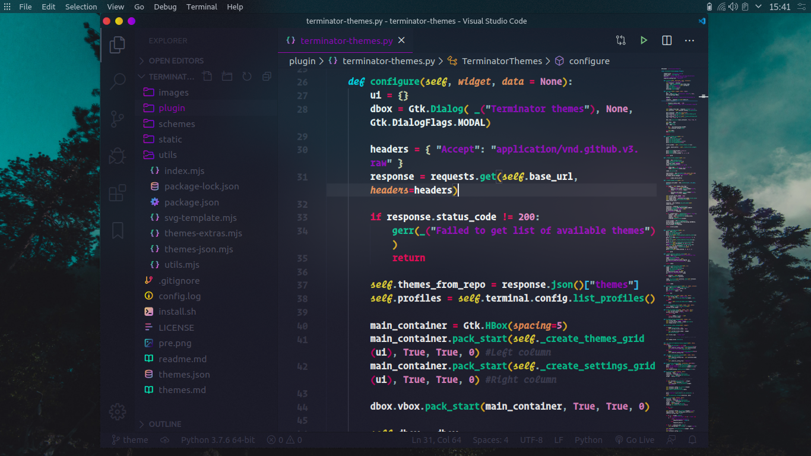

# Sweet vscode Icons

A colorful icon set for vscode based on the awesome [vscode-quill-icons](https://github.com/cdonohue/vscode-quill-icons/)

# Installation

1. Open the **Extensions** sidebar in VS Code. `View → Extensions`
1. Search for `Sweet Vscode icons`
1. Click **Install** to install it
1. Click **Reload** to reload your editor
1. Navigate to File > Preferences > File icon Theme > **sweet vscode icons**

## License

[MIT](https://github.com/EliverLara/sweet-vscode-icons/blob/master/LICENSE.md)